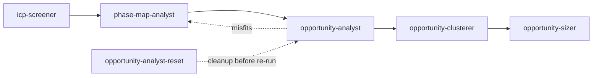

# Product Discovery Skills

A pipeline of [Claude Code](https://claude.com/claude-code) skills that take a folder of customer interview transcripts and turn it into a prioritized list of opportunities, end-to-end. Rooted in Teresa Torres' [Continuous Discovery Habits](https://www.producttalk.org/books/) and the [Opportunity Solution Tree](https://www.producttalk.org/opportunity-solution-tree/) (OST).

The skills work together as a pipeline, but each is independently invocable — install one, several, or all of them.

## Pipeline

```
icp-screener → phase-map-analyst → opportunity-analyst → opportunity-clusterer → opportunity-sizer
                       ↑                    │
                       └───── feedback ─────┘
                       (via opportunity-analyst-reset)
```



## Skills

| #   | Skill                                                            | What it does                                                  | Status         |
| --- | ---------------------------------------------------------------- | ------------------------------------------------------------- | -------------- |
| 1   | [`icp-screener`](skills/icp-screener/)                           | Filter raw transcripts to ICP matches; produce a TEMP folder  | shipped        |
| 2   | [`phase-map-analyst`](skills/phase-map-analyst/)                 | Build the first level of the OST: 3-8 phases of the JTBD      | shipped        |
| 3   | [`opportunity-analyst`](skills/opportunity-analyst/)             | Extract opportunities per transcript; tag each to a phase     | shipped        |
| 4   | [`opportunity-analyst-reset`](skills/opportunity-analyst-reset/) | Strip prior analyst output so the pipeline can re-run cleanly | shipped        |
| 5   | [`opportunity-clusterer`](skills/opportunity-clusterer/)         | Cluster opportunities across transcripts; hard-partition by phase; verbatim labels | shipped        |
| 6   | [`opportunity-sizer`](skills/opportunity-sizer/)                 | Score and prioritize clusters on importance × prevalence; surface the top focus    | shipped        |

## Install

Quick install (all skills):

```bash
git clone https://github.com/Elsevanderberg1/product-discovery-skills.git
cd product-discovery-skills
./install.sh
```

Install only specific skills:

```bash
./install.sh icp-screener
./install.sh phase-map-analyst opportunity-analyst opportunity-analyst-reset
```

Skills install to `~/.claude/skills/<skill-name>/`. Re-running install with the same skill replaces it.

## Quick start

After installing, point any of the skills at a folder of `.md` interview transcripts:

```
/icp-screener /path/to/transcripts
```

This produces an `icp-screened-TEMP-YYYY-MM-DD/` subfolder. Then run the rest of the pipeline against that folder:

```
/phase-map-analyst /path/to/transcripts/icp-screened-TEMP-YYYY-MM-DD
/opportunity-analyst /path/to/transcripts/icp-screened-TEMP-YYYY-MM-DD
/opportunity-clusterer /path/to/transcripts/icp-screened-TEMP-YYYY-MM-DD
/opportunity-sizer /path/to/transcripts/icp-screened-TEMP-YYYY-MM-DD
```

## How the skills relate

Each skill consumes the previous skill's TEMP folder. The artifacts inside that folder (the screening overview, the phase-map markdown, appended sections in transcripts) are the data contract between skills. If you change one skill's output format, the consuming skill needs to know — that's why this is a single repo with one fork-point and one versioned history.

The feedback loop matters: `phase-map-analyst` can detect existing `opportunity-analyst` output in the TEMP folder and offer to revise the map based on the misfit evidence. After revision, `opportunity-analyst-reset` strips the stale tagging so `opportunity-analyst` can re-run cleanly against the new map.

## Concepts

- **Job-to-be-Done (JTBD):** the functional job the customer is trying to get done.
- **Phase map:** a 3-8 step decomposition of the JTBD; the first level of the Opportunity Solution Tree.
- **Opportunity:** a pain, friction, wish, or desire — framed in the customer's voice, tagged to a phase.
- **Importance × Prevalence:** importance = how much one customer cares (1-5 scale, inferred only when stated). Prevalence = how many customers express the opportunity. Combined, they're the sizer's ranking signal.
- **Misfit bucket:** opportunities that move the product metric but don't fit any phase. Treated as evidence the phase map may need revision, not as noise to discard.

For deeper context, read Torres' [Continuous Discovery Habits](https://www.producttalk.org/books/) and her writing on the [Opportunity Solution Tree](https://www.producttalk.org/opportunity-solution-tree/).

## Design principles

- **Skills, not pipelines.** Each skill is independently invocable. The pipeline is a convention, not a runtime.
- **Markdown all the way down.** Inputs, outputs, and artifacts are all `.md` files. Human-readable, diff-friendly, no special tooling required.
- **Read-mostly on transcripts.** Only `opportunity-analyst` and its reset modify transcript files (by appending or stripping a clearly-labelled section). Everything else is read-only.
- **Misfits are signal.** Opportunities that don't fit any phase are surfaced explicitly, not silently re-tagged or dropped.

## Contributing

Issues and PRs welcome. If you propose a new skill or a change to an existing skill's data contract (i.e. anything another skill in the pipeline reads), please open an issue first to discuss the inter-skill consequences.

## License

MIT.

## Author

[Else van der Berg](https://github.com/Elsevanderberg1) — freelance product lead working with AI-forward startups and scale-ups.
